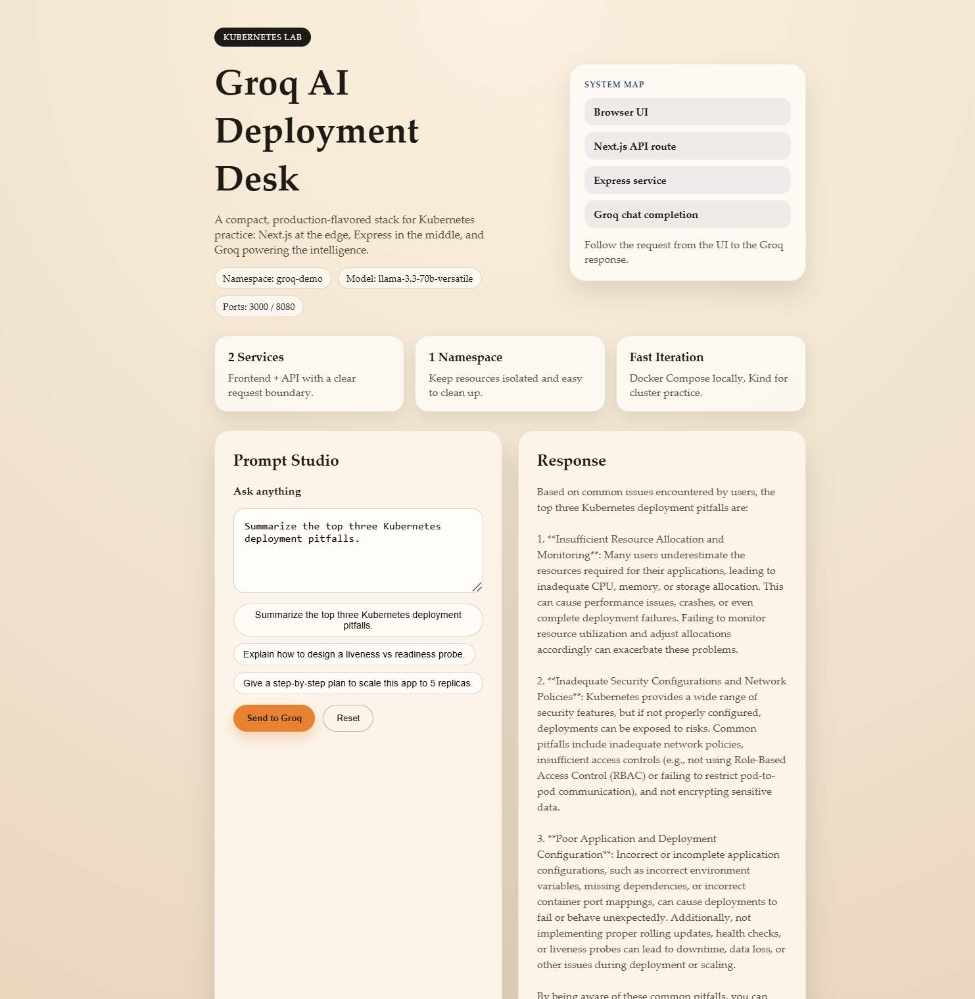

# Groq Kubernetes Lab

A compact, real-world learning project for Kubernetes + Groq AI. It is built to practice image builds, local dev, secrets management, and cluster workflows.



## Services 🧩

- Frontend: Next.js app with a server route that proxies to the API 🖥️
- API: Express service that calls Groq Chat Completions ⚙️

## Request Flow 🔁

Browser UI → Next.js `/api/chat` → Express API `/chat` → Groq Chat Completions → Reply back to UI

## Folder Guide 🗂️

- frontend/ 🎨
	- app/ — UI and API route
	- Dockerfile — frontend image
	- .env.example — frontend env reference
- api/ 🔌
	- src/ — Express API
	- Dockerfile — API image
	- .env.example — API env reference (no secrets)
	- .env — local secrets (gitignored)
- k8s/ ☸️
	- namespace.yaml — namespace isolation
	- configmap.yaml — non-secret config
	- secret.yaml — template only (no real secrets)
	- api-deployment.yaml, api-service.yaml
	- frontend-deployment.yaml, frontend-service.yaml
- docker-compose.yml — local dev (reads api/.env) 🧪

## Required Config 🧷

Local (api/.env) 🧾:
- GROQ_API_KEY (required)
- GROQ_MODEL (optional, default llama-3.3-70b-versatile)
- GROQ_MAX_TOKENS (optional)
- GROQ_TIMEOUT_MS (optional)
- GROQ_MAX_INPUT_CHARS (optional)

Kubernetes ☸️:
- Secret: GROQ_API_KEY
- ConfigMap: GROQ_MODEL, API_BASE_URL

## Local Workflow (Docker Compose) 🐳

1. Create api/.env:

```bash
GROQ_API_KEY=your_key_here
GROQ_MODEL=llama-3.3-70b-versatile
```

2. Build and run:

```bash
docker compose up --build
```

3. Open the UI:

http://localhost:3000

## Kubernetes Workflow (Kind) ☸️

1. Build images:

```bash
docker build -t groq-api:latest ./api
docker build -t groq-frontend:latest ./frontend
```

2. Load into Kind:

```bash
kind load docker-image groq-api:latest
kind load docker-image groq-frontend:latest
```

3. Create secret from api/.env (recommended):

```bash
kubectl -n groq-demo delete secret groq-secrets
kubectl -n groq-demo create secret generic groq-secrets --from-env-file=api/.env
```

4. Apply manifests:

```bash
kubectl apply -f k8s/namespace.yaml
kubectl apply -f k8s/configmap.yaml
kubectl apply -f k8s/secret.yaml
kubectl apply -f k8s/api-deployment.yaml
kubectl apply -f k8s/api-service.yaml
kubectl apply -f k8s/frontend-deployment.yaml
kubectl apply -f k8s/frontend-service.yaml
```

5. Port-forward:

```bash
kubectl -n groq-demo port-forward svc/frontend 3000:3000
```

6. Open the UI:

http://localhost:3000

## Security / Secrets 🔒

- Do not commit api/.env
- Keep k8s/secret.yaml as a template only
- Use `kubectl create secret` from api/.env for real keys

## Troubleshooting 🛠️

Pods not ready:

```bash
kubectl -n groq-demo get pods
kubectl -n groq-demo describe pod <pod-name>
```

API errors:

```bash
kubectl -n groq-demo logs deploy/api
```

Frontend not reachable:

```bash
kubectl -n groq-demo get svc
```

## References 📚

- Groq API: https://console.groq.com
- Kubernetes Docs: https://kubernetes.io/docs
- Kind Docs: https://kind.sigs.k8s.io
